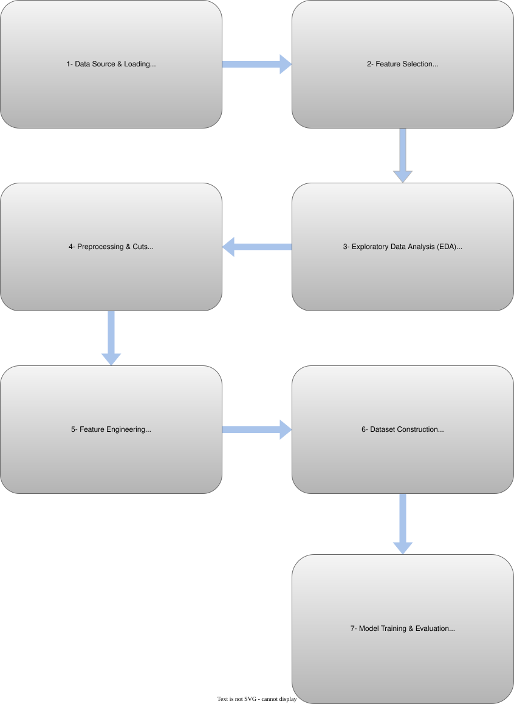
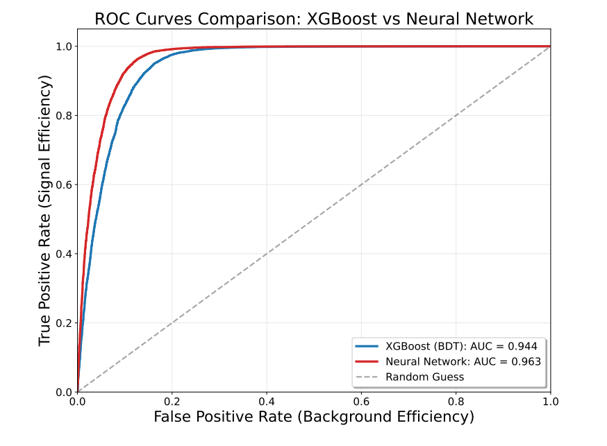

# Higgs Diphoton Signal-Background Classification

## Problem Definition

### Physics Context

The **Standard Model (SM)** is the theoretical framework that describes all known fundamental particles and three of the four fundamental interactions. An important part of this model is the Higgs boson, which gives mass to elementary particles through the Higgs mechanism. Its discovery in 2012 by the ATLAS and CMS experiments at CERN was a major milestone in particle physics.

One of the most experimentally significant Higgs decay channels is the diphoton mode **(H → γγ)**. Despite its small branching ratio, this channel provides a remarkably clean experimental signature with excellent invariant mass resolution, and it played a crucial role in the Higgs discovery.

### Signal vs. Background

However, not all diphoton events originate from Higgs decays. Quantum Chromodynamics (QCD) processes produce prompt γγ pairs, forming an **irreducible background**.

### Project Objective

This project develops a machine learning pipeline to distinguish Higgs diphoton signal events (H → γγ) from QCD diphoton background. Two classification algorithms are implemented and compared: XGBoost (BDT) and Neural Networks (NN). 

## Analysis Pipeline

  

## 📓 Notebook Overview
### 01 & 02: Data Exploration
Initial exploration of ATLAS Open Data samples (available at [ATLAS Open Data for Research](https://opendata.atlas.cern/docs/data/for_research/pp_data)). These notebooks load the ROOT files, extract photon-related branches  and visualize distributions to understand the basic characteristics of signal and background datasets.

### 03a & 03b: Preprocessing and Event Selection

These notebooks apply quality cuts and event selection criteria to both Higgs and QCD datasets to prepare the data for machine learning analysis.

- **Photon Quality Cut (IsEMTight):** Apply tight photon identification to ensure high-quality photon candidates, reducing misidentified jets.

- **Minimum Photon Requirement:** Select events containing at least 2 tight photons, as required for diphoton analysis.

- **Lead/Sublead Selection:** Sort photons by transverse momentum (pT) in descending order. The highest pT photon becomes the "leading" photon, and the second highest becomes the "subleading" photon.

- **Kinematic Cuts** (based on [ATLAS Higgs discovery analysis](https://www.sciencedirect.com/science/article/pii/S037026931200857X)):
   - **pT threshold:** Leading photon pT > 40 GeV, subleading photon pT > 30 GeV (ensures well-measured photons with sufficient energy)
   - **Detector acceptance:** |η| < 2.37 to stay within the calorimeter coverage
   - **Crack region veto:** Exclude photons with 1.37 < |η| < 1.52 

- **Save Processed Data:** Transformed data into pandas DataFrames for efficient processing. 
Saved processed datasets in Parquet format for both signal and background.

### 04: Feature Engineering
**Calculated angular separations:**
- ΔR (angular distance between photons)
- Δη (pseudorapidity difference)
- Δφ (azimuthal angle difference)

**Derived kinematic relationships:**
- pt_ratio (sublead/lead pt balance)
- pt_asymmetry (momentum imbalance measure)
- pt_sum (total transverse momentum)

Added all engineered features as new columns to both datasets. Saved feature-enhanced datasets in Parquet format for model training

### 05: Plain Training (Baseline)

Train an XGBoost (BDT) model using only raw kinematic features (without engineered features). This serves as a baseline to evaluate the impact of feature engineering on model performance in subsequent notebooks.

### 06: XGBoost Training (with Feature Engineering)

Train XGBoost (BDT) model using the feature-enhanced dataset. Includes feature importance analysis to identify the most discriminating variables and overfitting checks to ensure model generalization.

### 07: Neural Network Training (with Feature Engineering)

Train a Neural Network model using the feature-enhanced dataset. Uses a multi-layer architecture with dropout regularization. Includes overfitting checks to evaluate model performance and generalization capability.

## ⚠️ Methodological Considerations

### Exclusion of Invariant Mass (m_γγ)

The diphoton invariant mass (m_γγ) is the primary observable used in traditional Higgs discovery analyses. However, it was intentionally excluded from the feature set in this study for the following reasons:

- **Feature dominance:** Initial tests showed m_γγ dominated classification with ~80% feature importance, significantly overshadowing other kinematic variables.

- **Mass peak memorization:** Including m_γγ would allow the model to primarily rely on the distinctive 125 GeV Higgs mass peak, rather than learning from the broader kinematic and topological differences between signal and background events.

By excluding m_γγ, this analysis explores whether complementary kinematic features  can provide meaningful discrimination.

## 📊 Results

### Model Performance Comparison

| **Metric** | **XGBoost (BDT)** | **Neural Network** |
|------------|-------------------|--------------------|
| Test Accuracy | 0.8983 | 0.9227 |
| Test ROC-AUC | 0.9439 | 0.9625 |
| Training Accuracy | 0.9096 | 0.9267 |
| Training ROC-AUC | 0.9615 | 0.9661 |
| Train-Test Accuracy Gap | 0.0113 | 0.0040 |
| Train-Test AUC Gap | 0.0176 | 0.0036 |

The Neural Network achieves the best overall performance, while both models show minimal
train–test performance gaps, indicating limited overfitting.

### ROC Curves

## 📚 References & Sources

This analysis uses ATLAS Open Data Monte Carlo simulated samples, available under Creative Commons CC0 license via the CERN Open Data Portal.

**Datasets:**

- **Signal Sample:**  
  ATLAS collaboration (2024). *ATLAS DAOD_PHYSLITE format MC simulation Higgs nominal samples*. CERN Open Data Portal.  
  DOI: [10.7483/OPENDATA.ATLAS.Z2J9.709J](https://doi.org/10.7483/OPENDATA.ATLAS.Z2J9.709J)  
  Dataset: "`mc20_13TeV.PowhegPythia8EvtGen_NNLOPS_nnlo_30_ggH125_gamgam`"

- **Background Sample:**  
  ATLAS collaboration (2024). *ATLAS DAOD_PHYSLITE format MC simulation QCD jet nominal samples*. CERN Open Data Portal.  
  DOI: [10.7483/OPENDATA.ATLAS.OXQR.DJQ3](https://doi.org/10.7483/OPENDATA.ATLAS.OXQR.DJQ3)  
  Dataset: "`mc20_13TeV.Sherpa_224_NNPDF30NNLO_Diphoton_myy_90_175`"

  ### Acknowledgement
  We acknowledge the work of the ATLAS Collaboration to record or simulate, reconstruct, and distribute the Open Data used in this project, and to develop and support the software with which it was analysed.

  **Higgs Discovery:**
- ATLAS Collaboration. (2012). *Observation of a new particle in the search for the Standard Model Higgs boson with the ATLAS detector at the LHC*. Physics Letters B, 716(1), 1-29.  
  https://doi.org/10.1016/j.physletb.2012.08.020